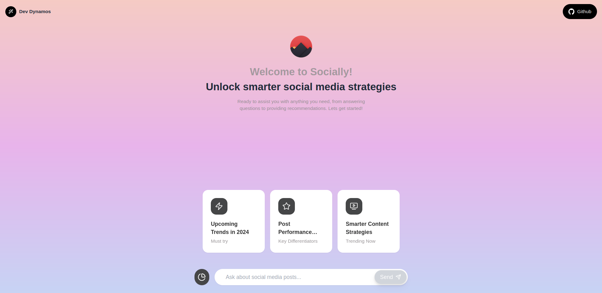
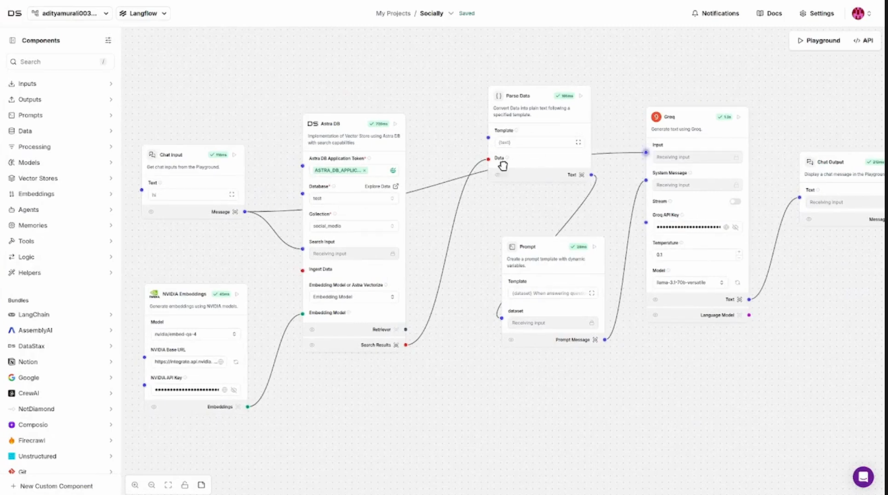
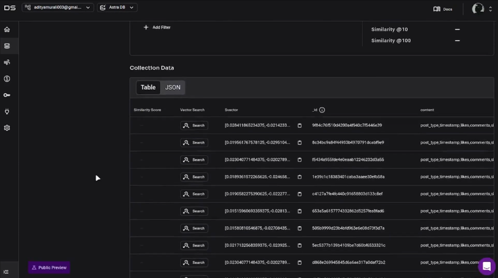
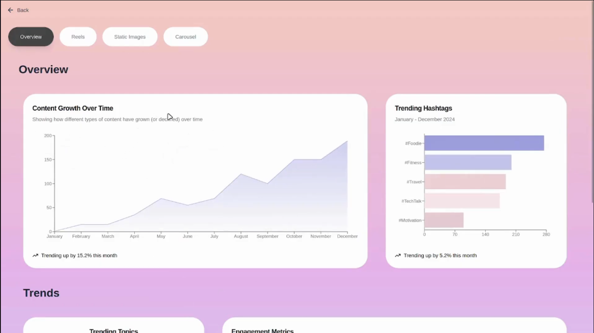
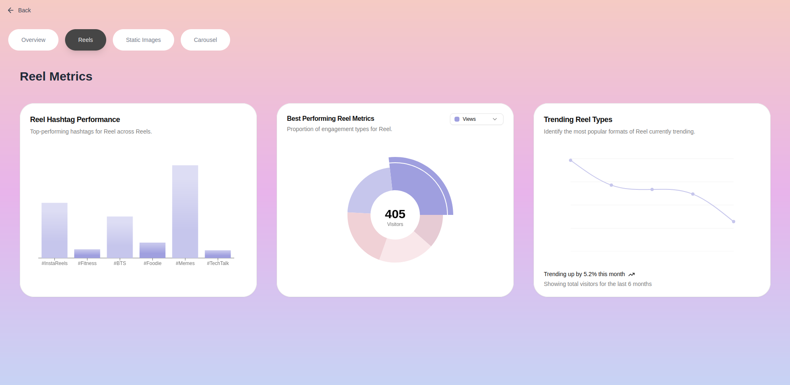

# AI Agent Tool: Social Media Engagement Analyzer

## Overview
This project is a social media engagement analyzer built using **DataStax Astra DB**, **Langflow**, and **Next.js**. The tool analyzes engagement data from mock social media accounts to derive insights about post performance, helping users make informed decisions about content strategies.

**The project is deployed at:** [https://socially-snowy.vercel.app/](https://socially-snowy.vercel.app/).

**Detailed Explanation of the Project**  [YouTube video](https://www.youtube.com/watch?v=sWw91OwDWIY&t=5s).

**Project Related Images**  [Images](#project-images)

---

## Features
1. **Engagement Data Simulation:**
   - Simulates a dataset of social media engagement metrics, including likes, shares, comments, and post types (e.g., carousel, reels, static images).

2. **Database Integration:**
   - Uses **DataStax Astra DB** to store and manage the simulated engagement data.

3. **Analytics Workflow:**
   - Utilizes **Langflow** to:
     - Accept user input for post types.
     - Query Astra DB to calculate average engagement metrics for each post type.

4. **Insights Generation:**
   - Leverages **GPT integration in Langflow** to provide simple, actionable insights based on the analyzed data.

---

## Setup and Installation

### Prerequisites
- Node.js
- DataStax Astra DB account
- Langflow account

### Steps
1. Clone the repository:
   ```bash
   git clone https://github.com/adityam003/socially
   ```

2. Install dependencies:
   ```bash
   cd socially
   npm install
   ```

3. Configure DataStax Astra DB:
   - Create a keyspace and table for the engagement dataset.
   - Update the database connection details in the `.env` file.

4. Run the Next.js application:
   ```bash
   npm run dev
   ```

5. Open Langflow and create a workflow:
   - Add nodes for user input, database querying, and GPT integration.
   - Save the workflow and integrate it with the Next.js application.

6. Access the application at:
   [http://localhost:3000](http://localhost:3000)

---

## Deployment
The project is deployed on Vercel at:
[https://socially-snowy.vercel.app/](https://socially-snowy.vercel.app/)

---

## Authors
- **Prathamesh Jakkula**  
  GitHub: [Prathamesh01110](https://github.com/Prathamesh01110)

- **Aditya MurliMohan**  
  GitHub: [adityam003](https://github.com/adityam003)

- **Aniket Giri**  
  GitHub: [theaniketgiri](https://github.com/theaniketgiri)

---

# Project Images

### Next.js UI


### Langflow Workflow


### DataStax Astra DB


### Analytics Dashboard


### Detailed Analytics


---


